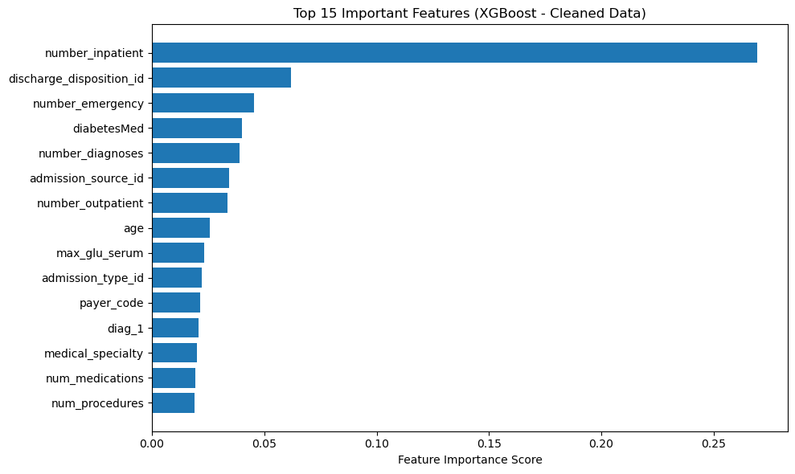
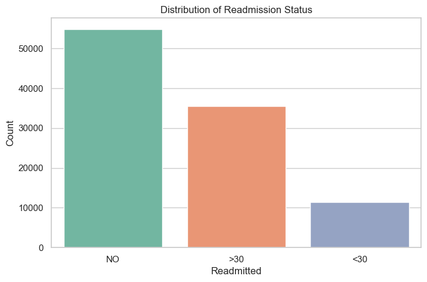
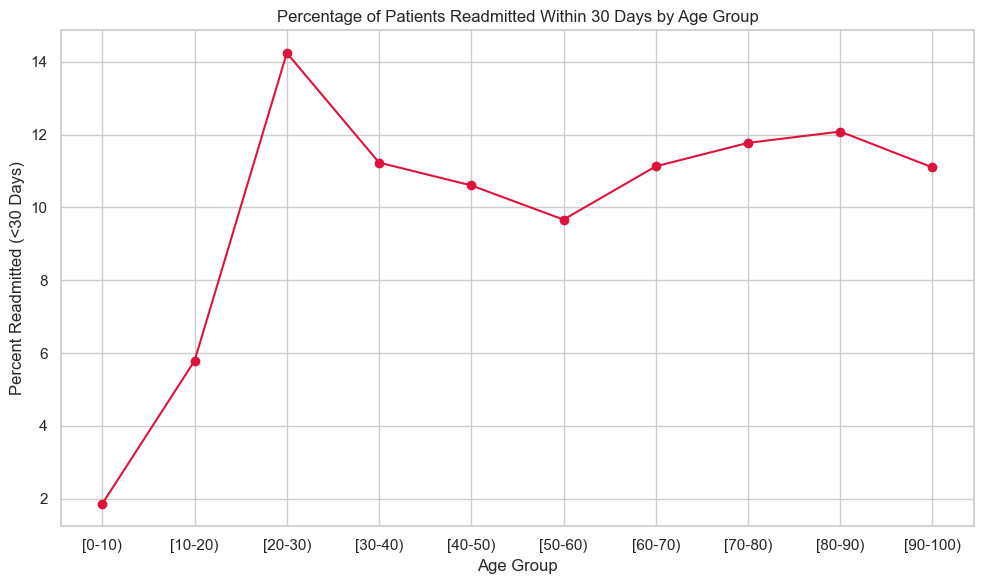

# Diabetes Hospital Readmission Prediction

**A tuned XGBoost model predicted hospital readmission for diabetic patients with about 65% accuracy (0.6545) on 20,354 test encounters. Prior inpatient visits were the strongest predictor.**

Python · pandas · scikit-learn · XGBoost · Seaborn · Matplotlib | July 2025 | Team project (my part: data preprocessing and EDA)

## Problem

We built this model as a pilot on the public UCI Diabetes 130-US Hospitals dataset, with the aim of adapting it to DHIS2 hospital records in Uganda. It has not yet been run on DHIS2 data.

Readmissions are costly for hospitals and often a sign that a patient's care after discharge was not enough. The aim was to predict which diabetic inpatients are likely to come back to hospital, and to find the clinical and operational factors behind it so follow-up care can be targeted.

**Note on the target:** the model predicts readmission at *any* time after discharge (within 30 days or later) versus no readmission. The EDA also looks at the within 30 day group separately.

## Dataset

- **Source:** [Diabetes 130-US Hospitals for Years 1999-2008](https://archive.ics.uci.edu/dataset/296/diabetes+130-us+hospitals+for+years+1999-2008), UCI Machine Learning Repository
- **Size:** 101,766 inpatient encounters from 130 US hospitals, 49 columns as loaded
- **Features:** demographics, admission and discharge details, time in hospital, prior inpatient, outpatient and emergency visits, diagnosis codes, lab results (A1C, max glucose serum) and diabetes medications
- Download steps are in [data/README.md](data/README.md). The raw CSV is not committed.

## Method

My work (preprocessing and EDA):

1. Replaced the `?` placeholders with missing values and measured how much was missing per column.
2. Dropped `weight` (96.9% missing). Filled `medical_specialty` (49.1% missing), `payer_code` (39.6%) and the diagnosis codes with "Unknown".
3. Relabelled `A1Cresult` and `max_glu_serum` into readable groups (No Test, Normal, High, Very High).
4. Explored readmission by age group, time in hospital, A1C result and max glucose serum.

Team modelling steps:

5. Dropped ID columns, made the target binary (readmitted = 1, not readmitted = 0) and label encoded the categorical columns.
6. Split 80/20 into train and test sets (`random_state=42`).
7. Tuned an `XGBClassifier` with `GridSearchCV` (3 fold CV, scored on macro F1) over `n_estimators`, `max_depth`, `learning_rate`, `subsample` and `colsample_bytree`. Best: 200 trees, depth 6, learning rate 0.1, subsample 0.8, colsample 0.8.
8. Ranked features with XGBoost feature importance.

## Results

| Metric (test set, 20,354 encounters) | Not readmitted (0) | Readmitted (1) |
|---|---|---|
| Precision | 0.66 | 0.64 |
| Recall | 0.73 | 0.56 |
| F1 score | 0.70 | 0.60 |
| Support | 10,952 | 9,402 |

Overall accuracy **0.6545**, macro F1 **0.65**.

Confusion matrix (rows are actual, columns are predicted):

| | Predicted not readmitted | Predicted readmitted |
|---|---|---|
| **Actual not readmitted** | 8,019 | 2,933 |
| **Actual readmitted** | 4,100 | 5,302 |

The top predictors were the number of prior inpatient visits (by a wide margin), discharge disposition, number of emergency visits, diabetes medication status and number of diagnoses.

<p align="center">
  
</p>

<p align="center">
  
  
</p>

More EDA charts (age distribution, time in hospital, A1C and glucose results) are in [figures/](figures/).

## Limitations

- **About 65% accuracy is a modest result.** It is a useful baseline for finding risk factors, not a model ready for clinical use.
- **Class imbalance.** In the original three class target, readmission within 30 days (`<30`) is by far the smallest group (see the distribution chart). Combining `<30` and `>30` gives a fairly even binary split (10,952 vs 9,402 in the test set), but the model still misses many readmitted patients: recall for that class is 0.56, so 4,100 of 9,402 were missed.
- The model predicts any readmission, not the 30 day readmission that hospitals are usually measured on. A dedicated `<30` model with class weights or resampling is the next step.
- Many patients have more than one encounter in the data. The split is by encounter, not by patient, so the same patient can appear in both train and test sets.
- Some discharge disposition codes mean the patient died or went to hospice, which rules out readmission. Those rows should be removed before modelling.
- Label encoding gives categorical codes an artificial order. Future work: better features (time since last admission), cost sensitive learning and richer data such as lab trends and clinical notes.

## Next steps: moving to DHIS2

- DHIS2 tracker data records patient visits as separate events, so readmission has to be derived by linking each patient's visits through their tracked entity ID and checking the time between discharge and the next admission.
- The UCI data uses ICD-9 diagnosis codes, while DHIS2 hospital records usually use ICD-10, so the diagnosis features need an ICD-9 to ICD-10 mapping.

## How to run

```bash
git clone https://github.com/mukisakaweesi/diabetes-readmission-xgboost.git
cd diabetes-readmission-xgboost
python -m venv .venv
source .venv/bin/activate        # on Windows: .venv\Scripts\activate
pip install -r requirements.txt jupyter
# download diabetic_data.csv into this folder (see data/README.md)
jupyter notebook diabetes_readmission.ipynb
```

The grid search fits 72 parameter combinations with 3 fold CV, so it can take a while on a laptop.

## Repository contents

```
diabetes_readmission.ipynb   preprocessing, EDA and model
figures/                     charts from the analysis
data/README.md               where to get the data
requirements.txt
LICENSE
```

## Contact

Kaweesi Abdulrahim Mukisa, healthcare data scientist in Kampala, Uganda

- Email: mukisakaweesi@gmail.com
- LinkedIn: https://www.linkedin.com/in/kaweesi-abdulrahim-mukisa-919326252/
- Portfolio: https://app.notion.com/p/1fcc3e1ef98f80e4bd57c2148954d746
